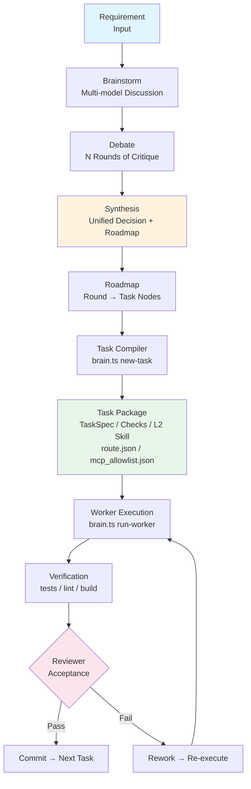
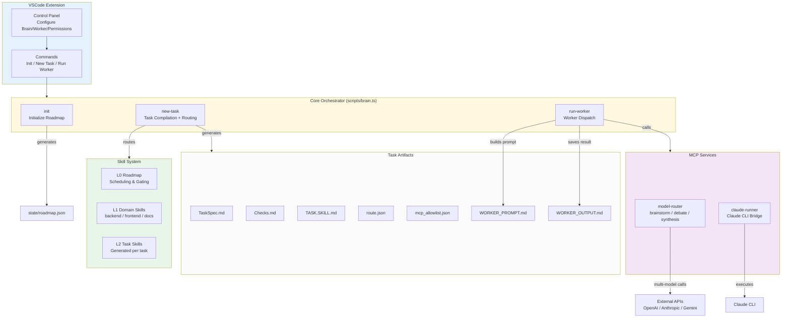
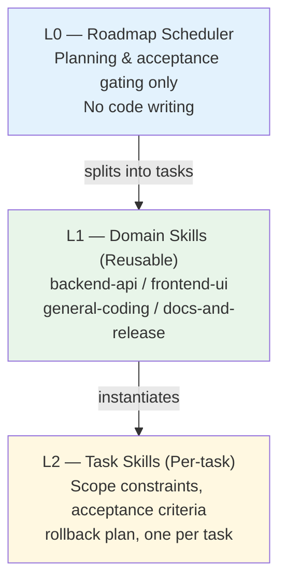
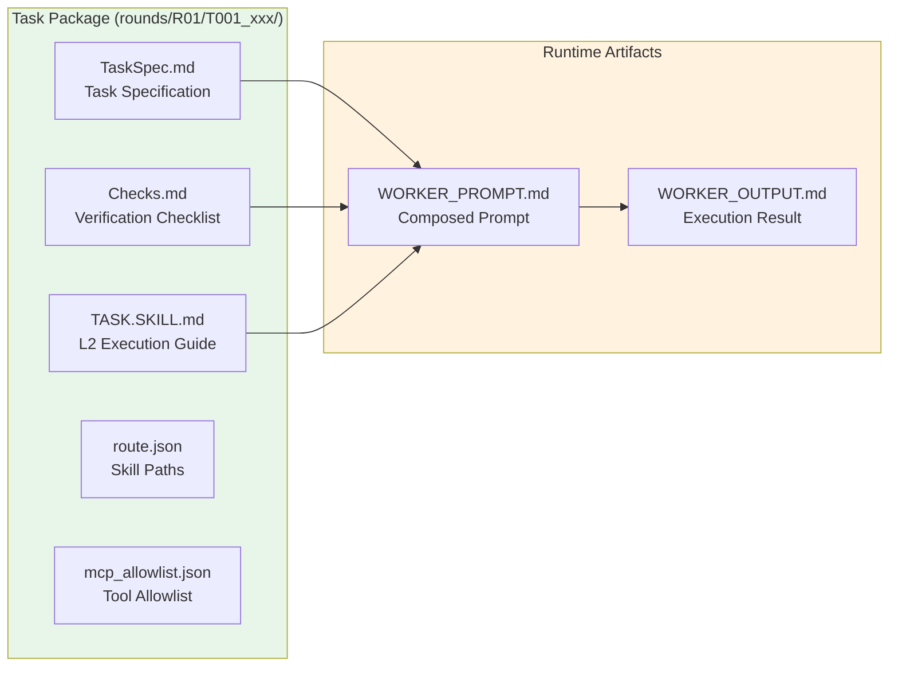
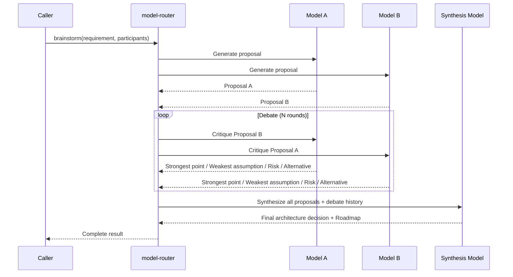

# AIStack

English documentation. Chinese version: [README.md](README.md)

AIStack is a **multi-model collaboration framework for software delivery**, orchestrating AI models into a complete engineering pipeline: from multi-model Brainstorm to Debate rounds, Synthesis into a unified plan, and finally compiling executable task packages for Worker models to execute and Reviewers to accept.

All core runtime is implemented in TypeScript/Node for easier VSCode extension distribution and cross-platform compatibility.

---

## Core Capabilities

- **Multi-model Brainstorm** — GPT / Claude / Gemini and more, discussing requirements simultaneously
- **Debate (N rounds)** — Models challenge, supplement, and critique each other
- **Synthesis** — A designated model consolidates all proposals into a unified decision + Roadmap
- **Task Compilation** — Auto-generates `TaskSpec + Checks + L2 Skill + MCP allowlist` task packages
- **Worker Execution** — Supports Claude CLI / OpenAI / Anthropic / Gemini / custom APIs
- **Reviewer Acceptance** — Automated acceptance based on diff + verification evidence

---

## Architecture Overview

### End-to-End Flow



### Component Relationship



---

## Project Structure

```
aistack/
├── scripts/
│   └── brain.ts                     # Core orchestrator: init / new-task / run-worker
├── mcp/
│   ├── model_router/
│   │   └── server.ts                # MCP service: multi-model brainstorm/debate/synthesis
│   └── claude_runner/
│       └── server.ts                # MCP service: Claude CLI bridge
├── vscode-extension/
│   └── src/extension.ts             # VSCode extension: Control Panel + commands
├── skills/
│   ├── L0.roadmap.SKILL.md          # L0: Roadmap scheduling (no code writing)
│   ├── L1.general-coding.SKILL.md   # L1: General coding
│   ├── L1.backend-api.SKILL.md      # L1: Backend / API / database
│   ├── L1.frontend-ui.SKILL.md      # L1: Frontend / UI
│   └── L1.docs-and-release.SKILL.md # L1: Documentation / releases
├── templates/
│   ├── task_spec.md.tmpl            # TaskSpec template
│   ├── checks.md.tmpl               # Checks verification template
│   └── task_skill.md.tmpl           # L2 Task Skill template
├── config/
│   └── router_rules.json            # Routing rules: keywords → L1 skills + MCP profiles
├── state/
│   └── roadmap.json                 # Roadmap state (rounds, tasks, goals)
├── rounds/                          # Task execution directory
│   └── R01/
│       └── T001_xxx/
│           ├── TaskSpec.md           # Task specification
│           ├── Checks.md            # Verification checklist
│           ├── TASK.SKILL.md         # L2 task skill
│           ├── route.json            # L1 + L2 skill paths
│           ├── mcp_allowlist.json    # Allowed MCP tools
│           ├── WORKER_PROMPT.md      # Composed worker prompt
│           └── WORKER_OUTPUT.md      # Worker execution result
├── docs/                            # Detailed documentation (bilingual)
├── dist/                            # Compiled output (tsc)
├── package.json
├── tsconfig.json
├── ROADMAP.md                       # Generated roadmap summary
└── LICENSE                          # GPL-3.0
```

---

## Skill Layers

AIStack uses a three-layer skill architecture, progressively refining from macro scheduling to concrete execution:



| Layer | File | Purpose | Lifecycle |
|-------|------|---------|-----------|
| **L0** | `skills/L0.roadmap.SKILL.md` | Roadmap scheduling, round management, acceptance gating | Project-level, singleton |
| **L1** | `skills/L1.*.SKILL.md` | Domain workflows (backend/frontend/docs) | Project-level, reusable |
| **L2** | `rounds/{round}/{task}/TASK.SKILL.md` | Per-task execution rules, scope, acceptance | Task-level, generated on demand |

### Routing Rules

`config/router_rules.json` automatically routes tasks to appropriate L1 skills via keyword matching:

- Keywords like `api`, `backend`, `database` → `L1.backend-api`
- Keywords like `ui`, `frontend`, `react`, `page` → `L1.frontend-ui`
- Keywords like `doc`, `release`, `changelog` → `L1.docs-and-release`
- Default → `L1.general-coding`

---

## Task Lifecycle

Each task is compiled by `brain.ts new-task` into a complete **Task Package** containing the following files:



| File | Purpose |
|------|---------|
| `TaskSpec.md` | Defines task objective, scope, files involved, acceptance criteria, rollback plan |
| `Checks.md` | Functional / quality / regression verification checklist |
| `TASK.SKILL.md` | L2 task skill: execution rules, boundary constraints, done definition |
| `route.json` | Records matched L1 skills + L2 skill path |
| `mcp_allowlist.json` | MCP tools allowed for this task + matched profiles |
| `WORKER_PROMPT.md` | Full prompt composed from TaskSpec + Checks + L2 Skill |
| `WORKER_OUTPUT.md` | Worker execution result (exit code / stdout / stderr / timeout status) |

---

## Permission Model

AIStack follows the **principle of least privilege** — each task only gets the MCP tools it needs:

### MCP Profile System

| Profile | Tools Included | Trigger Keywords |
|---------|----------------|------------------|
| **base** (always included) | `filesystem.read` `filesystem.write` `ripgrep.search` `shell.test` `git.diff` | — |
| **web_research** | `brave.web_search` `fetch.imageFetch` | `latest` `version` `doc` `reference` |
| **ui_validation** | `playwright.browser_snapshot` `playwright.browser_take_screenshot` | `ui` `frontend` `page` `mobile` |

### Dangerous Permission Switches

| Setting | Description |
|---------|-------------|
| `aiStack.permissions.dangerous.claude` | Enable `--dangerously-skip-permissions` for Claude |
| `aiStack.permissions.dangerous.codex` | Enable dangerous permissions for Codex |
| `aiStack.permissions.dangerous.gemini` | Enable dangerous permissions for Gemini |
| `aiStack.automation.fullAuto` | Enable all dangerous permissions (trusted environments only) |

---

## CLI Reference

### `init` — Initialize Project

```bash
node dist/scripts/brain.js init --goal "Project goal description"
```

| Parameter | Required | Description |
|-----------|----------|-------------|
| `--goal` | Yes | Project goal |

**Output**: `state/roadmap.json`, `ROADMAP.md`, directory structure (`state/`, `rounds/`, `skills/`, `templates/`, `config/`)

---

### `new-task` — Compile Task Package

```bash
node dist/scripts/brain.js new-task \
  --title "Implement router" \
  --goal "Generate task package" \
  --scope "scripts/,templates/,skills/" \
  --files "scripts/brain.ts,templates/,skills/" \
  --acceptance "Generates TaskSpec/Checks/allowlist;repeatable"
```

| Parameter | Required | Default | Description |
|-----------|----------|---------|-------------|
| `--title` | Yes | — | Task title |
| `--goal` | Yes | — | Task objective |
| `--scope` | Yes | — | Scope description |
| `--round` | No | `R01` | Round ID |
| `--owner` | No | `worker` | Task owner |
| `--files` | No | — | Files in scope (comma-separated) |
| `--do-not-touch` | No | — | Protected files (comma-separated) |
| `--acceptance` | No | — | Acceptance criteria (semicolon-separated) |
| `--verify-commands` | No | `npm test \|\| true; ...` | Verification commands |
| `--notes` | No | — | Additional notes |
| `--rollback` | No | Default text | Rollback plan |

**Output**: Complete task package under `rounds/{round}/{task_id}_{slug}/`

---

### `run-worker` — Execute Worker

```bash
# Claude CLI mode
node dist/scripts/brain.js run-worker \
  --task-dir rounds/R01/T001_implement_router \
  --worker claude \
  --dangerous-permissions

# Provider API mode
node dist/scripts/brain.js run-worker \
  --task-dir rounds/R01/T001_implement_router \
  --worker provider_api \
  --provider anthropic \
  --model claude-3-5-sonnet-20241022 \
  --api-key $ANTHROPIC_API_KEY

# Test mode
node dist/scripts/brain.js run-worker \
  --task-dir rounds/R01/T001_implement_router \
  --worker echo
```

| Parameter | Required | Default | Description |
|-----------|----------|---------|-------------|
| `--task-dir` | Yes | — | Task directory path |
| `--worker` | Yes | — | Worker type: `claude` / `provider_api` / `echo` |
| `--provider` | No | `openai` | API provider |
| `--model` | No | — | Model identifier |
| `--api-key` | No | — | API key |
| `--api-url` | No | — | Custom API endpoint |
| `--timeout-sec` | No | `180` | Timeout in seconds |
| `--temperature` | No | `0.2` | Sampling temperature |
| `--max-tokens` | No | `2048` | Maximum output tokens |
| `--dangerous-permissions` | No | — | Enable dangerous permissions |

**Output**: `WORKER_PROMPT.md` (composed prompt) + `WORKER_OUTPUT.md` (execution result)

---

## MCP Services

### model-router (Multi-model Router)

`mcp/model_router/server.ts` — Provides multi-model collaboration capabilities via MCP 2.0 protocol (JSON-RPC over stdin/stdout).

| Tool | Function | Description |
|------|----------|-------------|
| `model.one_shot` | Single model call | Supports OpenAI / Anthropic / Gemini / custom APIs |
| `model.brainstorm` | Multi-model discussion + debate + synthesis | Proposals → Debate (N rounds) → Synthesis |

**Brainstorm Flow**:



### claude-runner (Claude CLI Bridge)

`mcp/claude_runner/server.ts` — Executes Claude CLI commands within the MCP framework.

| Tool | Function |
|------|----------|
| `claude.one_shot` | Execute a single Claude prompt (with optional context files) |
| `claude.review_diff` | Review a unified diff patch (security / regression risks) |
| `claude.generate_patch` | Generate a unified diff from task description and context |

---

## VSCode Extension

The AIStack VSCode extension provides a graphical control panel and command shortcuts.

### Commands

| Command | Description | Access |
|---------|-------------|--------|
| `AIStack: Open Control Panel` | Open the configuration WebView | `Cmd+Shift+P` → search |
| `AIStack: Init Roadmap` | Initialize a new Roadmap | Panel button / Command Palette |
| `AIStack: Create Task Package` | Create a task package | Panel button / Command Palette |
| `AIStack: Run Worker` | Execute a Worker | Panel button / Command Palette |

### Control Panel Configuration

- **Brain Config**: Provider / API URL / Model / API Key
- **Worker Config**: Provider / API URL / Model / Timeout / API Key
- **Permission Control**: Full auto mode / per-model dangerous permissions (Claude / Codex / Gemini)
- API Keys are securely stored using VSCode SecretStorage

---

## Documentation

| Document | Chinese | English |
|----------|---------|---------|
| Architecture & Flow | [`docs/ARCHITECTURE.md`](docs/ARCHITECTURE.md) | [`docs/ARCHITECTURE.en.md`](docs/ARCHITECTURE.en.md) |
| Installation | [`docs/INSTALL.md`](docs/INSTALL.md) | [`docs/INSTALL.en.md`](docs/INSTALL.en.md) |
| Security | [`docs/SECURITY.md`](docs/SECURITY.md) | [`docs/SECURITY.en.md`](docs/SECURITY.en.md) |
| Release Process | [`docs/RELEASE.md`](docs/RELEASE.md) | [`docs/RELEASE.en.md`](docs/RELEASE.en.md) |
| Versioning | [`docs/VERSIONING.md`](docs/VERSIONING.md) | [`docs/VERSIONING.en.md`](docs/VERSIONING.en.md) |
| License Policy | [`docs/LICENSE_POLICY.md`](docs/LICENSE_POLICY.md) | [`docs/LICENSE_POLICY.en.md`](docs/LICENSE_POLICY.en.md) |

---

## Quick Start

```bash
# 1. Install dependencies and build
npm install
npm run build

# 2. Initialize Roadmap
node dist/scripts/brain.js init --goal "Build AIStack workflow"

# 3. Create a task package
node dist/scripts/brain.js new-task \
  --title "Implement router" \
  --goal "Generate task package" \
  --scope "scripts/,templates/,skills/" \
  --files "scripts/brain.ts,templates/,skills/" \
  --acceptance "Generates TaskSpec/Checks/allowlist;repeatable"

# 4. Execute Worker
node dist/scripts/brain.js run-worker \
  --task-dir "rounds/R01/T001_implement_router" \
  --worker claude \
  --dangerous-permissions
```

---

## License

[GPL-3.0-or-later](LICENSE)
