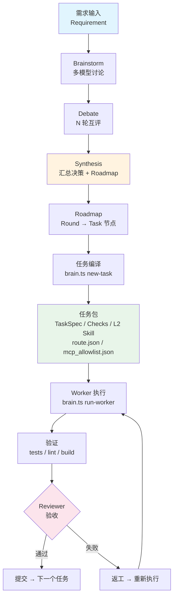
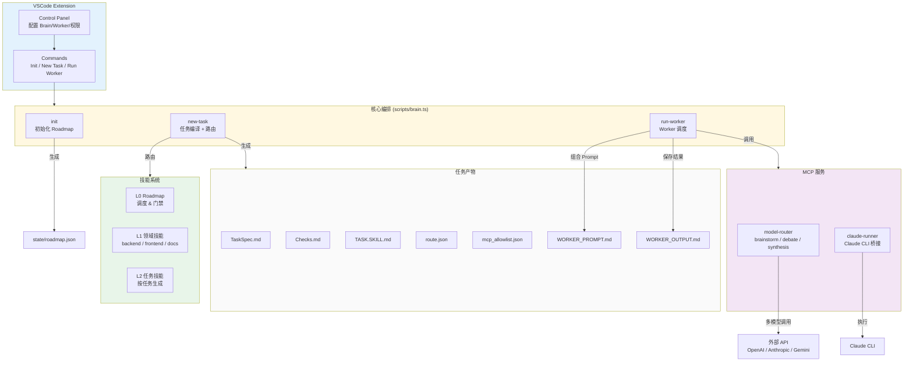
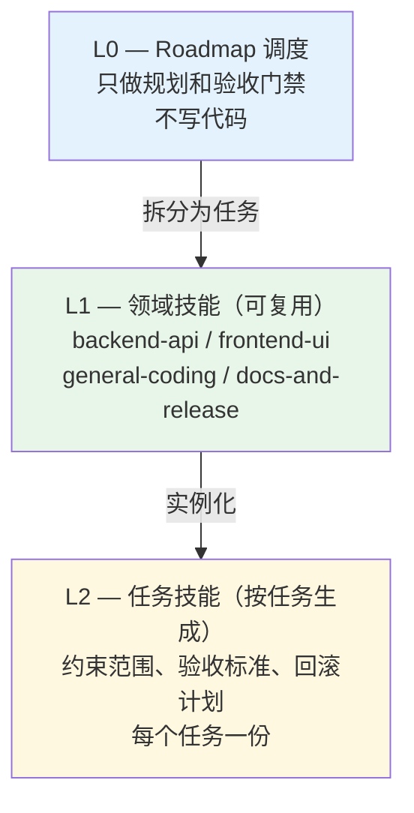
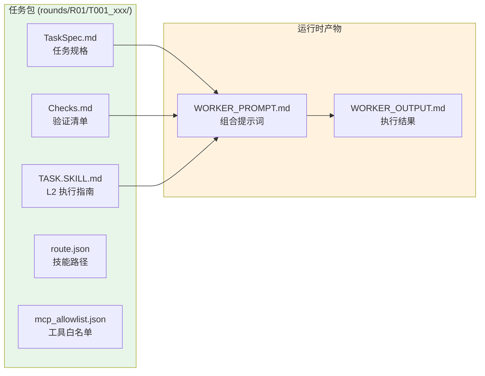
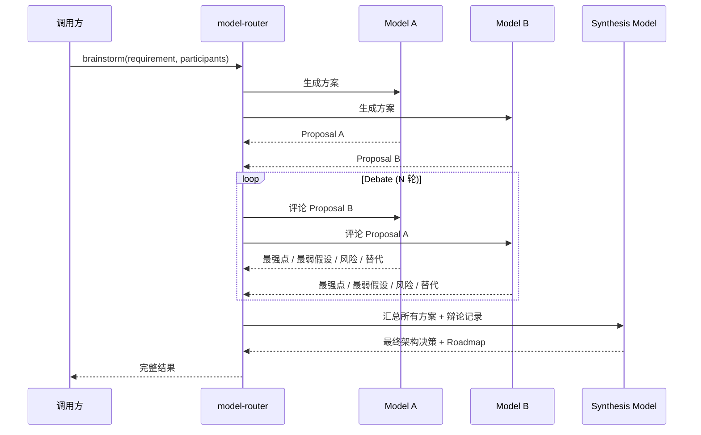

# AIStack

中文主文档。English version: [README.en.md](README.en.md)

AIStack 是一个**多模型协作的软件交付框架**，将 AI 模型的能力编排为完整的工程流水线：从多模型 Brainstorm 到 Debate 互评，再到 Synthesis 汇总方案，最终编译为可执行的任务包交由 Worker 模型执行、Reviewer 验收。

核心运行时全部为 TypeScript/Node，便于 VSCode 插件发布与跨平台分发。

---

## 核心能力

- **多模型 Brainstorm** — 可选 GPT / Claude / Gemini 等模型同时讨论需求
- **Debate 多轮互评** — 模型之间互相质疑、补充、挑战
- **Synthesis 汇总** — 指定模型汇总所有方案为统一决策 + Roadmap
- **任务编译** — 自动生成 `TaskSpec + Checks + L2 Skill + MCP allowlist` 任务包
- **Worker 执行** — 支持 Claude CLI / OpenAI / Anthropic / Gemini / 自定义 API
- **Reviewer 验收** — 基于 diff + 验证证据的自动化验收

---

## 架构总览

### 端到端流程



### 组件关系图



---

## 项目结构

```
aistack/
├── scripts/
│   └── brain.ts                     # 核心编排：init / new-task / run-worker
├── mcp/
│   ├── model_router/
│   │   └── server.ts                # MCP 服务：多模型 brainstorm/debate/synthesis
│   └── claude_runner/
│       └── server.ts                # MCP 服务：Claude CLI 桥接
├── vscode-extension/
│   └── src/extension.ts             # VSCode 插件：Control Panel + 命令
├── skills/
│   ├── L0.roadmap.SKILL.md          # L0：Roadmap 调度（不写代码）
│   ├── L1.general-coding.SKILL.md   # L1：通用编码
│   ├── L1.backend-api.SKILL.md      # L1：后端 / API / 数据库
│   ├── L1.frontend-ui.SKILL.md      # L1：前端 / UI
│   └── L1.docs-and-release.SKILL.md # L1：文档 / 发布
├── templates/
│   ├── task_spec.md.tmpl            # TaskSpec 模板
│   ├── checks.md.tmpl               # Checks 验证清单模板
│   └── task_skill.md.tmpl           # L2 Task Skill 模板
├── config/
│   └── router_rules.json            # 路由规则：关键词 → L1 技能 + MCP Profile
├── state/
│   └── roadmap.json                 # Roadmap 状态（轮次、任务、目标）
├── rounds/                          # 任务执行目录
│   └── R01/
│       └── T001_xxx/
│           ├── TaskSpec.md           # 任务规格
│           ├── Checks.md            # 验证清单
│           ├── TASK.SKILL.md         # L2 任务技能
│           ├── route.json            # L1 + L2 技能路径
│           ├── mcp_allowlist.json    # 允许的 MCP 工具
│           ├── WORKER_PROMPT.md      # 组合后的 Worker 提示词
│           └── WORKER_OUTPUT.md      # Worker 执行结果
├── docs/                            # 详细文档（中英双语）
├── dist/                            # 编译输出（tsc）
├── package.json
├── tsconfig.json
├── ROADMAP.md                       # 生成的 Roadmap 摘要
└── LICENSE                          # GPL-3.0
```

---

## Skill 技能分层

AIStack 采用三层技能架构，从宏观调度到具体执行逐层细化：



| 层级 | 文件 | 用途 | 生命周期 |
|------|------|------|----------|
| **L0** | `skills/L0.roadmap.SKILL.md` | Roadmap 调度、轮次管理、验收门禁 | 项目级，全局唯一 |
| **L1** | `skills/L1.*.SKILL.md` | 领域工作流（后端/前端/文档等） | 项目级，可复用 |
| **L2** | `rounds/{round}/{task}/TASK.SKILL.md` | 单任务执行规则、范围、验收 | 任务级，按需生成 |

### 路由规则

`config/router_rules.json` 通过关键词匹配，自动将任务路由到合适的 L1 技能：

- 包含 `api`、`backend`、`database` 等关键词 → `L1.backend-api`
- 包含 `ui`、`frontend`、`react`、`page` 等关键词 → `L1.frontend-ui`
- 包含 `doc`、`release`、`changelog` 等关键词 → `L1.docs-and-release`
- 默认 → `L1.general-coding`

---

## 任务生命周期

每个任务由 `brain.ts new-task` 编译为一个完整的**任务包**（Task Package），包含以下文件：



| 文件 | 作用 |
|------|------|
| `TaskSpec.md` | 定义任务的目标、范围、涉及文件、验收标准、回滚方案 |
| `Checks.md` | 功能 / 质量 / 回归的验证清单，Worker 需逐项通过 |
| `TASK.SKILL.md` | L2 任务技能：执行规则、边界约束、完成定义 |
| `route.json` | 记录匹配到的 L1 技能 + L2 技能路径 |
| `mcp_allowlist.json` | 该任务允许使用的 MCP 工具列表 + Profile |
| `WORKER_PROMPT.md` | 由 TaskSpec + Checks + L2 Skill 组合而成的完整提示词 |
| `WORKER_OUTPUT.md` | Worker 执行结果（exit code / stdout / stderr / 超时状态） |

---

## 权限模型

AIStack 采用**最小权限原则**，每个任务只获得必要的 MCP 工具：

### MCP Profile 系统

| Profile | 包含工具 | 触发关键词 |
|---------|----------|------------|
| **base** (始终包含) | `filesystem.read` `filesystem.write` `ripgrep.search` `shell.test` `git.diff` | — |
| **web_research** | `brave.web_search` `fetch.imageFetch` | `latest` `version` `doc` `reference` |
| **ui_validation** | `playwright.browser_snapshot` `playwright.browser_take_screenshot` | `ui` `frontend` `page` `mobile` |

### 危险权限开关

| 配置项 | 说明 |
|--------|------|
| `aiStack.permissions.dangerous.claude` | 为 Claude 开启 `--dangerously-skip-permissions` |
| `aiStack.permissions.dangerous.codex` | 为 Codex 开启危险权限 |
| `aiStack.permissions.dangerous.gemini` | 为 Gemini 开启危险权限 |
| `aiStack.automation.fullAuto` | 统一开启所有危险权限（仅建议可信环境） |

---

## CLI 命令参考

### `init` — 初始化项目

```bash
node dist/scripts/brain.js init --goal "项目目标描述"
```

| 参数 | 必填 | 说明 |
|------|------|------|
| `--goal` | 是 | 项目目标 |

**产出**：`state/roadmap.json`、`ROADMAP.md`、目录结构（`state/`、`rounds/`、`skills/`、`templates/`、`config/`）

---

### `new-task` — 编译任务包

```bash
node dist/scripts/brain.js new-task \
  --title "Implement router" \
  --goal "Generate task package" \
  --scope "scripts/,templates/,skills/" \
  --files "scripts/brain.ts,templates/,skills/" \
  --acceptance "Generates TaskSpec/Checks/allowlist;repeatable"
```

| 参数 | 必填 | 默认值 | 说明 |
|------|------|--------|------|
| `--title` | 是 | — | 任务标题 |
| `--goal` | 是 | — | 任务目标 |
| `--scope` | 是 | — | 范围描述 |
| `--round` | 否 | `R01` | 轮次 ID |
| `--owner` | 否 | `worker` | 任务归属 |
| `--files` | 否 | — | 涉及文件（逗号分隔） |
| `--do-not-touch` | 否 | — | 禁止修改的文件（逗号分隔） |
| `--acceptance` | 否 | — | 验收标准（分号分隔） |
| `--verify-commands` | 否 | `npm test \|\| true; ...` | 验证命令 |
| `--notes` | 否 | — | 补充说明 |
| `--rollback` | 否 | 默认回滚文案 | 回滚方案 |

**产出**：`rounds/{round}/{task_id}_{slug}/` 下的完整任务包

---

### `run-worker` — 执行 Worker

```bash
# Claude CLI 模式
node dist/scripts/brain.js run-worker \
  --task-dir rounds/R01/T001_implement_router \
  --worker claude \
  --dangerous-permissions

# Provider API 模式
node dist/scripts/brain.js run-worker \
  --task-dir rounds/R01/T001_implement_router \
  --worker provider_api \
  --provider anthropic \
  --model claude-3-5-sonnet-20241022 \
  --api-key $ANTHROPIC_API_KEY

# 测试模式
node dist/scripts/brain.js run-worker \
  --task-dir rounds/R01/T001_implement_router \
  --worker echo
```

| 参数 | 必填 | 默认值 | 说明 |
|------|------|--------|------|
| `--task-dir` | 是 | — | 任务目录路径 |
| `--worker` | 是 | — | Worker 类型：`claude` / `provider_api` / `echo` |
| `--provider` | 否 | `openai` | API 提供商 |
| `--model` | 否 | — | 模型标识 |
| `--api-key` | 否 | — | API 密钥 |
| `--api-url` | 否 | — | 自定义 API 端点 |
| `--timeout-sec` | 否 | `180` | 超时秒数 |
| `--temperature` | 否 | `0.2` | 采样温度 |
| `--max-tokens` | 否 | `2048` | 最大输出 token |
| `--dangerous-permissions` | 否 | — | 开启危险权限 |

**产出**：`WORKER_PROMPT.md`（组合提示词）+ `WORKER_OUTPUT.md`（执行结果）

---

## MCP 服务

### model-router（多模型路由）

`mcp/model_router/server.ts` — 提供多模型协作能力，MCP 2.0 协议（JSON-RPC over stdin/stdout）。

| 工具 | 功能 | 说明 |
|------|------|------|
| `model.one_shot` | 单模型单次调用 | 支持 OpenAI / Anthropic / Gemini / 自定义 API |
| `model.brainstorm` | 多模型讨论 + 辩论 + 汇总 | Proposals → Debate(N轮) → Synthesis |

**Brainstorm 流程**：



### claude-runner（Claude CLI 桥接）

`mcp/claude_runner/server.ts` — 在 MCP 框架内执行 Claude CLI 命令。

| 工具 | 功能 |
|------|------|
| `claude.one_shot` | 执行单次 Claude 提示（支持上下文文件） |
| `claude.review_diff` | 审查 unified diff 补丁（安全性 / 回归风险） |
| `claude.generate_patch` | 从任务描述生成 unified diff 补丁 |

---

## VSCode 扩展

AIStack VSCode 扩展提供图形化的控制面板和命令快捷入口。

### 命令

| 命令 | 说明 | 快捷方式 |
|------|------|----------|
| `AIStack: Open Control Panel` | 打开控制面板 WebView | `Cmd+Shift+P` → 搜索 |
| `AIStack: Init Roadmap` | 初始化 Roadmap | 面板按钮 / 命令面板 |
| `AIStack: Create Task Package` | 创建任务包 | 面板按钮 / 命令面板 |
| `AIStack: Run Worker` | 执行 Worker | 面板按钮 / 命令面板 |

### 控制面板配置

- **Brain 配置**：Provider / API URL / Model / API Key
- **Worker 配置**：Provider / API URL / Model / Timeout / API Key
- **权限控制**：全自动模式 / 按模型开启危险权限（Claude / Codex / Gemini）
- API Key 使用 VSCode SecretStorage 安全存储

---

## 文档导航

| 文档 | 中文 | English |
|------|------|---------|
| 架构与流程图 | [`docs/ARCHITECTURE.md`](docs/ARCHITECTURE.md) | [`docs/ARCHITECTURE.en.md`](docs/ARCHITECTURE.en.md) |
| 安装部署 | [`docs/INSTALL.md`](docs/INSTALL.md) | [`docs/INSTALL.en.md`](docs/INSTALL.en.md) |
| 安全与脱敏 | [`docs/SECURITY.md`](docs/SECURITY.md) | [`docs/SECURITY.en.md`](docs/SECURITY.en.md) |
| 发布流程 | [`docs/RELEASE.md`](docs/RELEASE.md) | [`docs/RELEASE.en.md`](docs/RELEASE.en.md) |
| 版本规则 | [`docs/VERSIONING.md`](docs/VERSIONING.md) | [`docs/VERSIONING.en.md`](docs/VERSIONING.en.md) |
| 授权策略 | [`docs/LICENSE_POLICY.md`](docs/LICENSE_POLICY.md) | [`docs/LICENSE_POLICY.en.md`](docs/LICENSE_POLICY.en.md) |

---

## 快速开始

```bash
# 1. 安装依赖并编译
npm install
npm run build

# 2. 初始化 Roadmap
node dist/scripts/brain.js init --goal "Build AIStack workflow"

# 3. 创建任务包
node dist/scripts/brain.js new-task \
  --title "Implement router" \
  --goal "Generate task package" \
  --scope "scripts/,templates/,skills/" \
  --files "scripts/brain.ts,templates/,skills/" \
  --acceptance "Generates TaskSpec/Checks/allowlist;repeatable"

# 4. 执行 Worker
node dist/scripts/brain.js run-worker \
  --task-dir "rounds/R01/T001_implement_router" \
  --worker claude \
  --dangerous-permissions
```

---

## License

[GPL-3.0-or-later](LICENSE)
